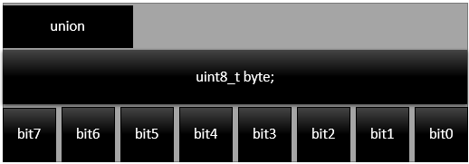

# Prerequisite: 
Understood the concept of struct and union in C

# 1. Data Alignment
```C
typedef struct{
	char expiryDate[10];
	int servingSize;
	double calciumPerServing;
}Milk_Brand;

int main(void){
	Milk_Brand DutchLady={"15.10.2021", 1000, 1.14};
	Milk_Brand GoodDay={"26.10.2021", 2000, 2.36};
  ....
}
```
# Question A
- What is the size of struct Milk_Brand?
- Draw a diagram to show the arrangment of data of the struct
- Explain briefly why?
- What if the type of calciumPerServing is of float type?

# 2. Bit Fields
```C
union{
	uint8_t byte;
	struct{
	uint8_t bit0 :1;
	uint8_t bit1 :1;
	uint8_t bit2 :1;
	uint8_t bit3 :1;
	uint8_t bit4 :1;
	uint8_t bit5 :1;
	uint8_t bit6 :1;
	uint8_t bit7 :1;
	};
}byte_t;
```
</br>
In the above example, names can be assigned to each bit of the struct or union member.</br>

# Question B
- Create a function that takes address of a varialbe of any type(int8_t, uint8_t, int16_t, uint16_t, int32_t, uint32_t, float, double)
  and number of byte(s) of the variable then print out every bit of the variable using the concept above.
- Ask for user's input for 2 things, type of variable(any one of int8_t, uint8_t, int16_t, uint16_t, int32_t, uint32_t, float, double), value of variable
- If the type of variable entered is not valid, report error.
- If the type of variable is valid, print out the all the bits of the variable with the function above.
  
# Submission
Submit your answer of Question A in text form and recording of code and output for Question B<br/>
Make sure the recording is easy for seniors to check<br/>
To any one of the following seniors before `11.59pm 30/10/2021`
- Chia Ming Lok
- Haikal bin Azhar
- Lee Jia Quan
